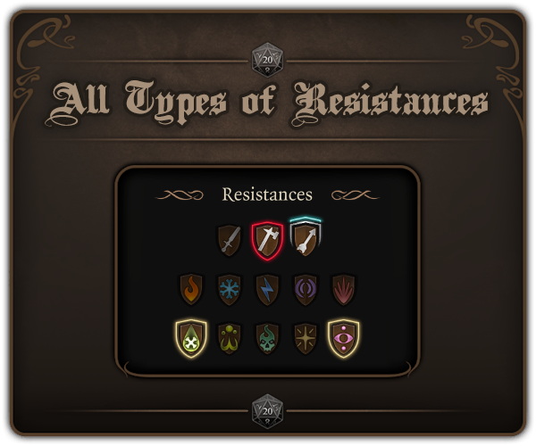
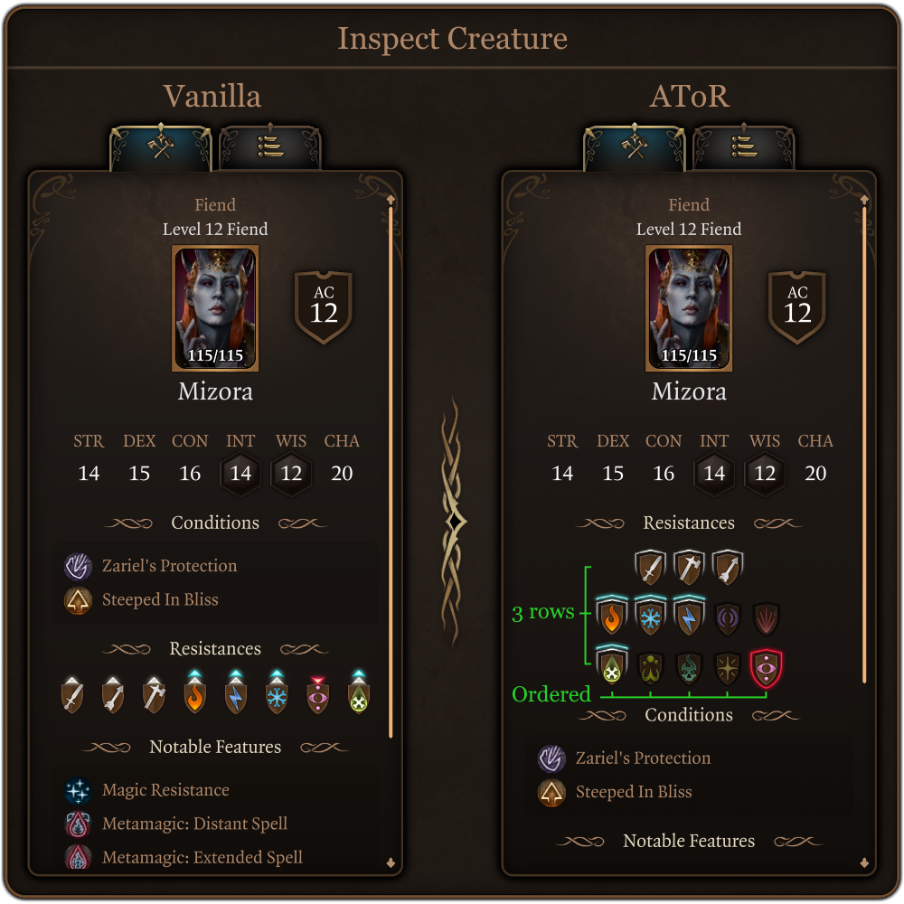
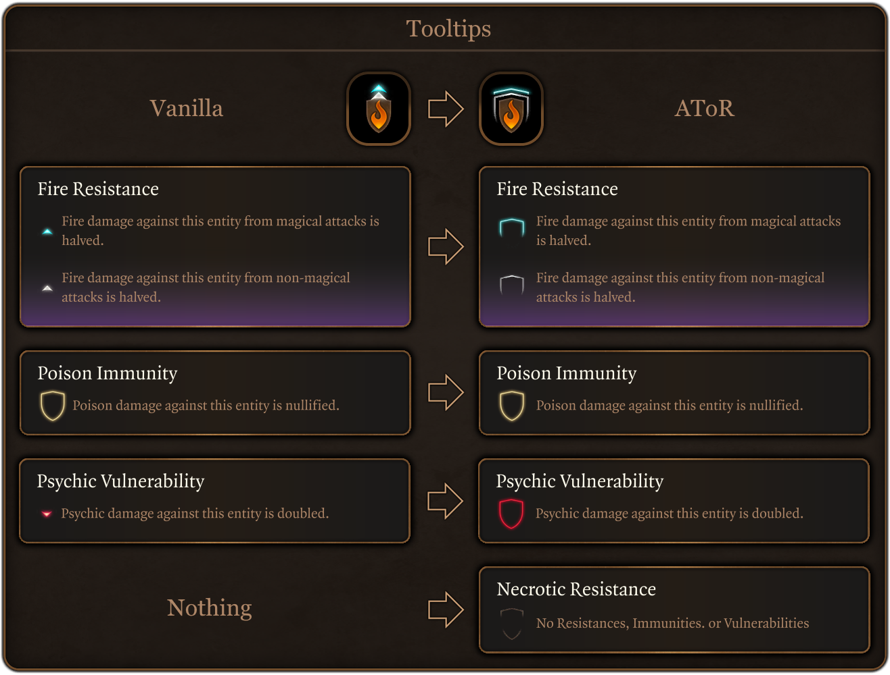
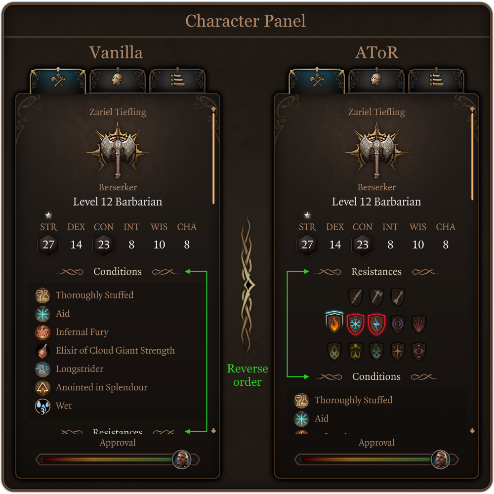
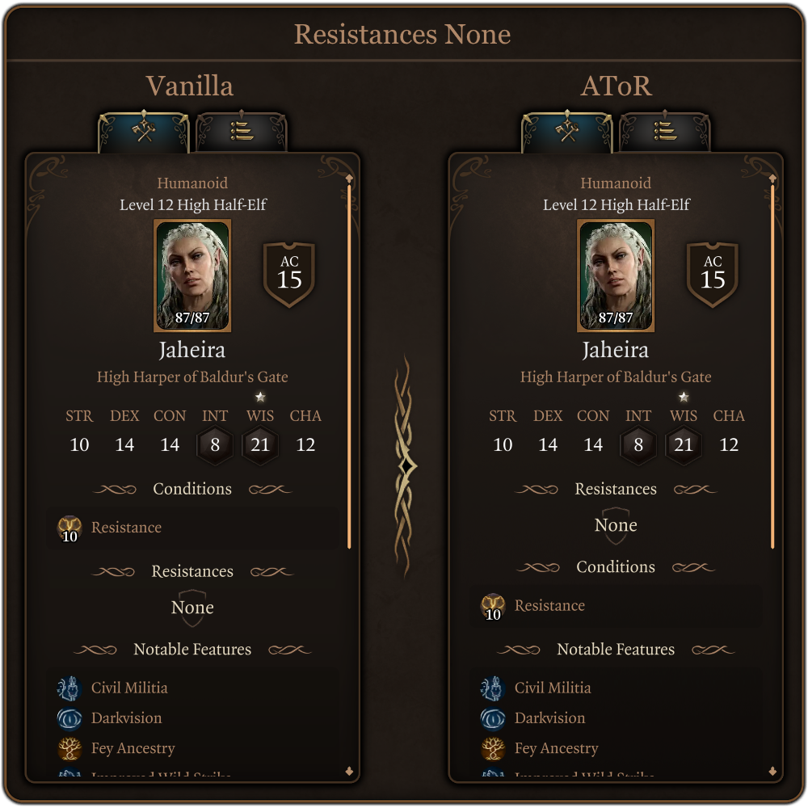
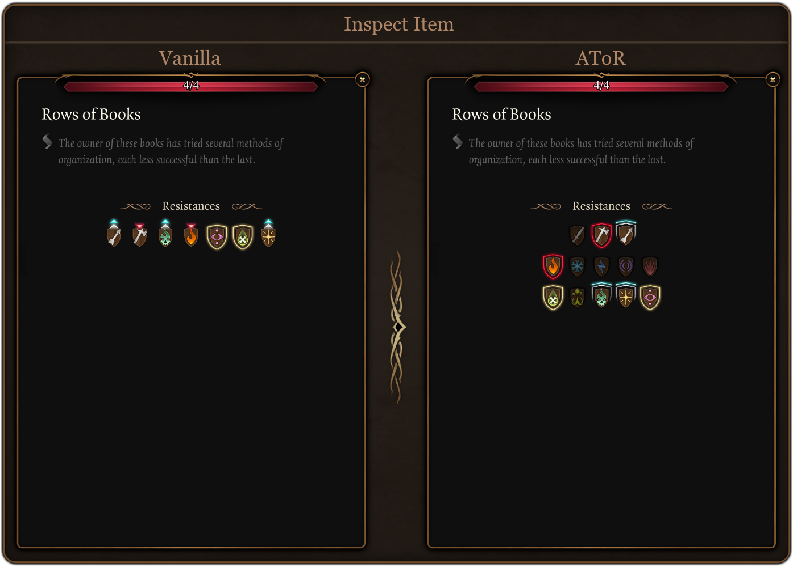
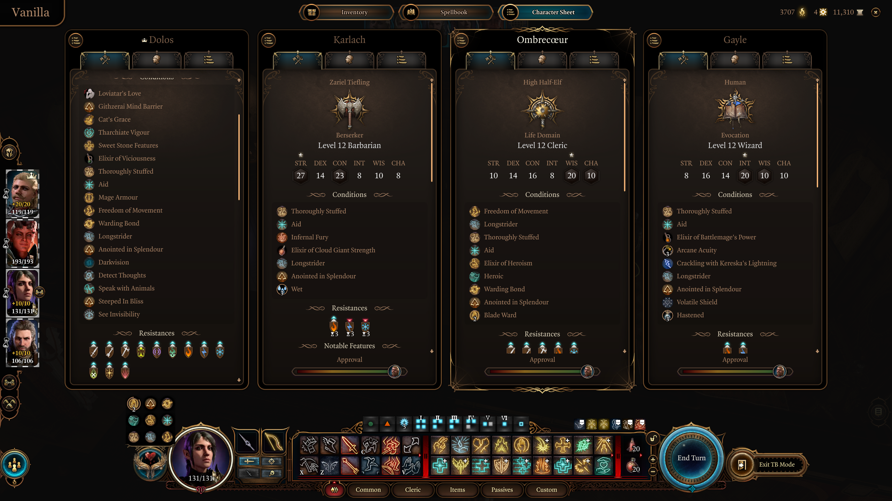
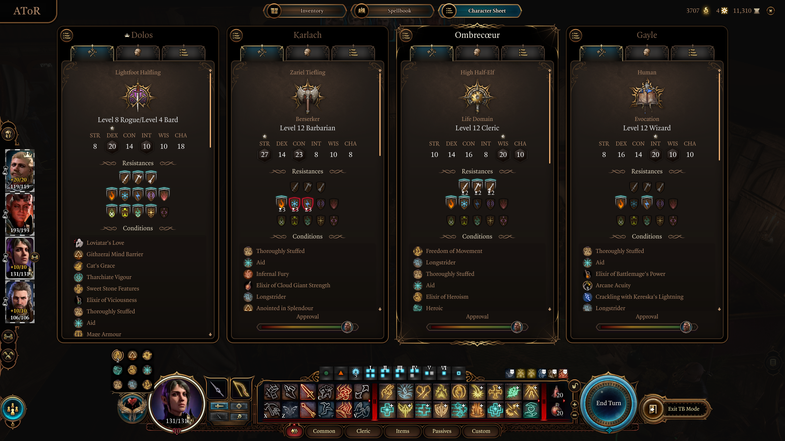

# AToR : All Types of Resistance (BG3 mod)

  

This is a mod for the game Baldur's Gate 3. The purpose of this mod is to display all types of resistance including ones without any immunity, resistance or weakness.

> [!NOTE]
> - AToR mod version : `0.4.0`
> - BG3 compatible version : `4.1.1`

## 💾 Install

Dowload the mod : [Releases](https://github.com/Coyote-31/bg3-all-types-of-resistance/releases).

Drop the `.pak` file from the archive to `user/appdata/local/larian studios/baldur's gate 3/mods`.
Or install it with `BG3 Mod Manager` / `Vortex`.

With `BG3 Mod Manager` : The mod should be in **Overrides**.
With `Vortex` : Mark the mod as **replacer** .

## ❌ Uninstall

Remove the mod's `.pak` file manually from `user/appdata/local/larian studios/baldur's gate 3/mods`. Or with `BG3 Mod Manager` / `Vortex`.

## ✨ Features

- Display all types of resistance including ones without any immunity, resistance or weakness.
- Resistances are divided into 3 rows and rearranged.
- Reverse order between Resistances and Conditions.
- Some icons are reworked for a better visual.
- Tooltip added for damage type without any immunity, resistance or weakness.

## 🔍 Screenshots

### All resistance icons grouped & ordered :

  

### Tooltips :

  

### Character panel :

  

### Resistances none :

  

### Inspect items :

  

### Party tab :

  

  

