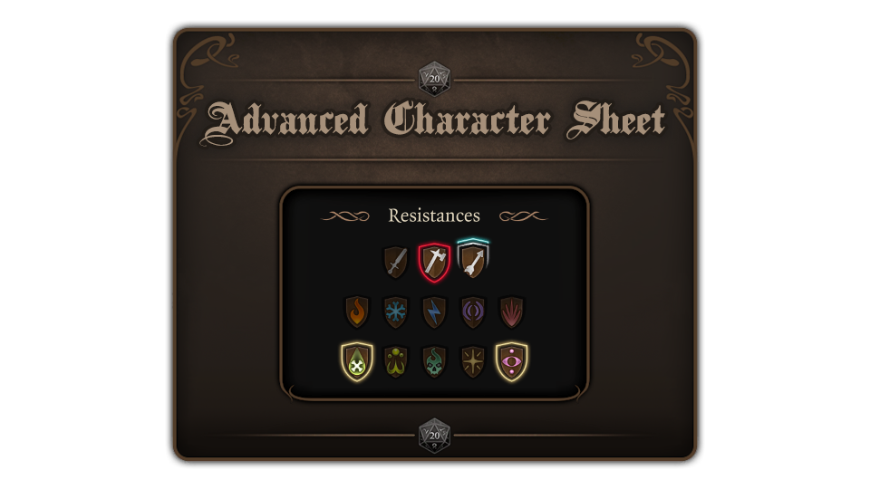

  

# ACS : Advanced Character Sheet (BG3 mod)

This is a mod for the game **Baldur's Gate 3**.

The purpose of this mod is to improve Character and Party panel. Also display **All Types of Resistance** including ones without any immunity, resistance or weakness.

> [!CAUTION]
> This mod is renamed !
> Previously named : All Types of Resistance.
> Delete manually AToR old mod version.

## 🔖 Version
- 📦 **ACS** mod : `2.0.0`
- 🎮 **BG3** compatibility : `Hotfix #19 [ Patch6_Hotfix2 ]`

## ✨ Features

**BIG** rework of the whole Character Sheet and Party Panel, it's actually much more than just *All Types of Resistance* now ! 😅
- The user interface is now *responsive* to be compatible with all variations of **BCPP** mods.
- Extend the **size** of useful content in Party Panel.
- **Align** everything in its right place.
- Replace some backgrounds and sprites to **fix artifacts** in vanilla images ( Party Panel Bg, Tabs, ... ).
- Full review of the **Inventory** for Character and Party Panels.
- Full review of the **Equipment** for Character and Party Panels.

*All Types of Resistance*:
- Display **all** types of resistance including ones without any immunity, resistance or weakness.
- Resistances are divided into **3 rows** and **rearranged**.
- **Reverse order** between Resistances and Conditions.
- Some icons are reworked for a **better visual**.
- **Tooltip added** for damage type without any immunity, resistance or weakness.

## 🔀 Compatibility

### 🟢 **Compatible** with the following mods :
- **Better Character and Party Panels** ( *BCPP* ) *All variants* : Tested with BCPP v1.6.0 ( Alias 1.6 )
- **Better Tooltips** ( *BT* ) : Tested with BT v1.1.1 ( Alias 1.11 )
- **Better Target Info** ( *BTI* ) : Tested with BTI v1.2.0.1 ( Alias 1.2 )

    > The icons of resistance work fine. Unfortunately, I can't achieved to display the none ones. But 13 icons on top of the screen all the time is what you really want to anyway ?

### 🟡 Compatible with **minor bugs** :
- None -> *Tell me if you find one ❗*

### 🔴 **Not compatible** with the following mods :
- None -> *Tell me if you find one ❗*

### 📄 Modified Files :

This mod changes the following files of the game :

- Public\Game\GUI\Library\
  - **CharacterSheetTemplates_k.xaml**
  - **Images_k.xaml**

## 💾 Install

### Download the mod : 
- [GitHub](https://github.com/Coyote-31/bg3-advanced-character-sheet/releases)
- [NexusMods](https://www.nexusmods.com/baldursgate3/mods/6458)

### Manual :
Drop the `.pak` file from the `.zip` archive inside the folder :

    %LocalAppData%\Larian Studios\Baldur's Gate 3\Mods

### Manager :
- With `BG3 Mod Manager` : The mod should be in **Overrides**.
- With `Vortex` : Mark the mod as **replacer**.

## ❌ Uninstall

### Manual :
Remove the mod's `.pak` file from :

    %LocalAppData%\Larian Studios\Baldur's Gate 3\Mods

### Manager :

- With `BG3 Mod Manager`.
- With `Vortex`.

## 🔍 Screenshots

### All resistance icons grouped & ordered :

  

### Reverse Resistances & Conditions order :

  

### Tooltips :

  

### Resistances none :

  

### Inspect items :

  

### Party tab :

  

  

