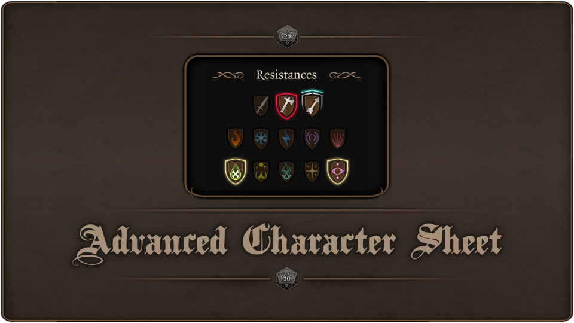
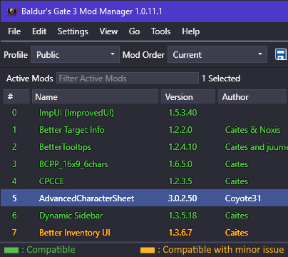
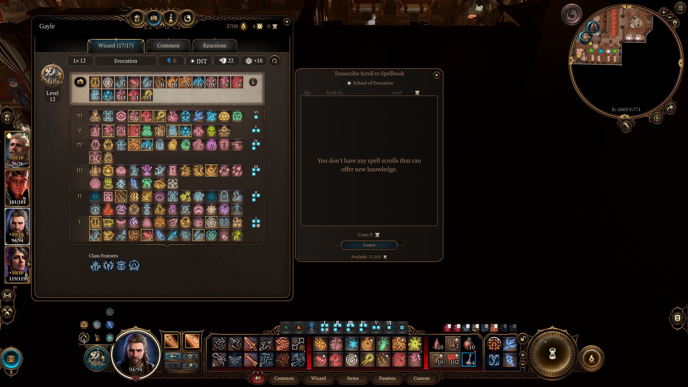
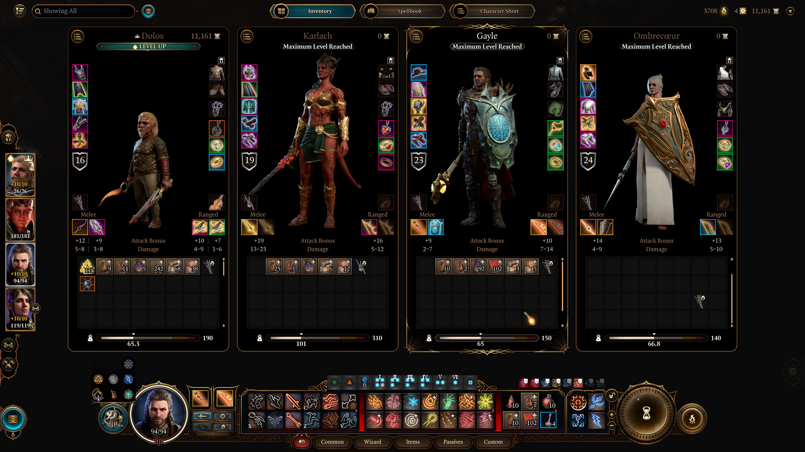

  

# ACS : Advanced Character Sheet (BG3 mod)

This is a mod for the game **Baldur's Gate 3**.

The purpose of this mod is to improve Character, Party and Companions Panels. 
Also display **All Types of Resistance** including ones without any immunity, resistance or weakness.

## 🔖 Version
- 📦 **ACS** mod : `3.1.1`
- 🎮 **BG3** compatibility : `Patch 8`

## ✨ Features

**BIG** rework of the whole Character Sheet and Party Panel, it's actually much more than just *All Types of Resistance* now ! 😅
- The user interface is now *responsive* to be compatible with all variations of **BCPP** mods.
- Extend the **size** of useful content in Party Panel.
- **Align** everything in its right place.
- Replace some backgrounds and sprites to **fix artifacts** in vanilla images ( Party Panel Bg, Tabs, ... ).
- Rework **Inventory** for Character and Party Panels.
- Rework **Equipment** for Character and Party Panels.
- Rework *Camp/Companions* Panels.
- Rework *Alchemy* Panels.
- Add **Button in Spells Book** to open *learn from scrolls* & collapse section before *prepared spells*.
- Add **Button in Character and Party Panels** to open *Camp/Companions* Panel even out of camp.
- Add **Button in Character Panel** to switch between *Info & Equipment* (like in Camp/Companions panel)
- Add more **slots** to *inventories*.

*All Types of Resistance*:
- Display **all** types of resistance including ones without any immunity, resistance or weakness.
- Resistances are divided into **3 rows** and **rearranged**.
- **Reverse order** between Resistances and Conditions.
- Some icons are reworked for a **better visual**.
- **Tooltip added** for damage type without any immunity, resistance or weakness.

## 🔀 Compatibility

🚨 You have to respect this load order for the compatibility between these mods :

  

### 🟢 **Compatible** with the following mods :
- **Better Character and Party Panels** ( *BCPP* ) *All variants* : Tested with BCPP v1.6.5
- **Better Tooltips** ( *BT* ) : Tested with BT v1.2.4
- **Better Target Info** ( *BTI* ) : Tested with BTI v1.2.3

    > The icons of resistance work fine. Unfortunately, I can't achieved to display the none ones. But 13 icons on top of the screen all the time is what you really want to anyway ?
    
- **Companions Panel and Camp Chest Everywhere** ( *CPCCE* ) : Tested with CPCCE v1.2.3
- **Dynamic Sidebar** ( *DS* ) : Tested with DS v1.3.5
- **Scroll Learning SE**
- **No Spell Prep SE**
- **ImpUI**

### 🟡 Compatible with **minor bugs** :
- None -> *Tell me if you find one ❗*

### 🔴 **Not compatible** with the following mods :
- None -> *Tell me if you find one ❗*

### 📄 Modified Files :

This mod changes the following files of the game :

- GUI\Library\
  - **CharacterSheetTemplates_k.xaml**
  - **Images_k.xaml**
  
- GUI\Pages\
  - **CharacterPanel.xaml**
  - **CompanionsPanel.xaml**
  - **LearnSpells.xaml**

## 💾 Install

### Download the mod : 
- [GitHub](https://github.com/Coyote-31/bg3-advanced-character-sheet/releases)
- [NexusMods](https://www.nexusmods.com/baldursgate3/mods/6458)
- [BG3 Mod.io](https://mod.io/g/baldursgate3/m/advancedcharactersheet)

### Manual :
Drop the `.pak` file from the `.zip` archive inside the folder :

    %LocalAppData%\Larian Studios\Baldur's Gate 3\Mods

### Manager :
- With `BG3 Mod Manager` or `Vortex` : You have to respect the mod load order with Pavelk's mods (see compatibility).

## ❌ Uninstall

🚨 If you uninstall from the ingame manager : **restart** your game after.

### Manual :
Remove the mod's `.pak` file from :

    %LocalAppData%\Larian Studios\Baldur's Gate 3\Mods

### Manager :

- Delete with `BG3 Mod Manager`.
- Delete with `Vortex`.

## 🔍 Screenshots

### All Resistance Tooltips :

  

### All Resistance icons grouped & ordered :

  

### Reverse Resistances & Conditions order :

  

### Inspect items :

  

### Character & Camp/Companions Panel :

  

  

  

  

  

  

### Spell Book Panel :

  

  

  

  

### Alchemy Panel :

  

  

  

### Illithid Panel :

  

### Party Panel :

  

  

  

  

  

